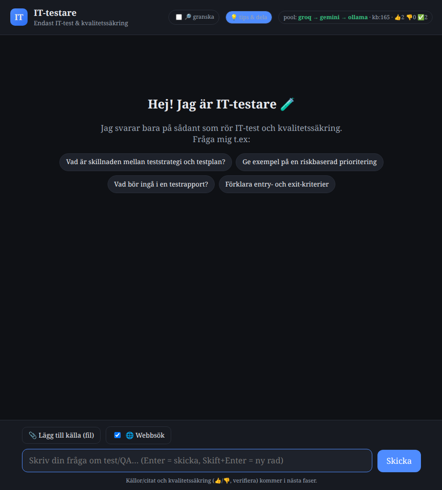

# TestARN 🧩

**En lokal AI-assistent som bara kan IT-test & kvalitetssäkring.** Den körs på din egen dator,
svarar på svenska, visar alltid källor — och kan kopplas ihop med andra så att ni delar frågor,
svar och kunskap.

> Byggd för att vara **gratis**, **privat** och **enkel att komma igång med**. Bara själva
> språkmodellsanropet lämnar datorn.



## Funktioner

- 🎯 **Bara test** – håller sig till IT-test/QA och avvisar annat artigt.
- 🇸🇪 **Svenska** i första hand.
- 🔀 **Provider-pool** – Groq → Gemini → lokal Ollama, med automatisk växling (aldrig "slut" i praktiken).
- 📚 **Kunskapsbas (RAG)** – egna dokument + webbsidor; lokala embeddings (ingen kvot, helt privat).
- 🔎 **Källor i varje svar** – klickbara, märkta `kb` / `web` / `community`.
- 📎 **Filuppladdning** – PDF, Word, PowerPoint, Excel, HTML, txt, md, csv, json m.fl.
- 🌐 **Webbsök** mot en vitlista av testkällor (gratis).
- ✅ **Kvalitetssäkring** – 👍/👎, "verifiera" (betrodd kunskapsbank) och valfritt granskningsläge.
- 🌍 **Gemensam bas** – dela frågor & svar med gruppen via en delad (hemlig) GitHub-gist. En knapp.
- 🖥️ **App-känsla** – installerbar som app (PWA) / eget fönster, ikon på skrivbord & i Startmenyn.

## Snabbstart

**Enklast:** öppna **https://simonteklee.github.io/it-testare/** och välj ditt system (knappar + kopiera).

### Linux / macOS
```bash
curl -fsSL https://raw.githubusercontent.com/simonteklee/it-testare/main/install.sh | bash
```

### Windows (PowerShell)
```powershell
irm https://raw.githubusercontent.com/simonteklee/it-testare/main/install.ps1 | iex
```

Skriptet installerar allt (via [`uv`](https://docs.astral.sh/uv/) – inget Python-krav), frågar efter
två **gratisnycklar** och startar. Se [`SETUP.md`](SETUP.md) för manuell installation.

Nycklar (gratis, inga kort):
- **Groq:** https://console.groq.com/keys
- **Google Gemini:** https://aistudio.google.com/apikey

## Så funkar det

```
Fråga → "bara test"-lager → kunskapsbas (RAG) + webbsök (vitlista)
      → provider-pool (Groq → Gemini → Ollama) → svar + källor
      → 👍/👎/verifiera  →  delas med gruppen (valfritt)
```

| Del | Teknik |
|-----|--------|
| Backend | Python + FastAPI (`app/`) |
| Frontend | HTML/CSS/JS (`web/`), Markdown-rendering |
| LLM | Provider-pool (Groq, Gemini, Ollama) – `app/llm.py` |
| Kunskapsbas | Lokala embeddings (`fastembed`) + JSONL-vektorlagring – `app/kb.py` |
| Inläsning | `app/extract.py` (pdf/docx/pptx/xlsx/html/txt) |
| Webbsök | DuckDuckGo + vitlista – `app/search.py` |
| Kvalitet | feedback + verifiering – `app/feedback.py` |
| Delning | GitHub Gist – `app/share.py`, `app/community.py` |

Se [`docs/ARKITEKTUR.md`](docs/ARKITEKTUR.md) för detaljer.

## Dela & gemensam bas

- **Dela med en vän:** skicka installationsraden ovan.
- **Gemensam bas:** slå på **🌍 Gemensam bas** i panelen *💡 tips & dela* och klicka **Synka**.
  Alla som gjort samma sak ser varandras frågor & svar och kan återanvända varandras prompter.
  (Standardrummet är förvalt – ingen id-kopiering behövs.) Detaljer: [`docs/DELNING.md`](docs/DELNING.md).

## Integritet & kostnad

- Allt ligger **lokalt** hos dig (`data/`). Nycklar i `.env` (committas aldrig).
- **Inget kostar pengar:** gratistjänster + lokal embeddings. Gratis LLM-tjänster har tak (t.ex. Groq ~1000/dag).
- Den gemensamma basen delar **bara** det du aktivt synkar (och kan stängas av).

## Utveckling

```bash
git clone https://github.com/simonteklee/it-testare.git
cd it-testare
uv venv .venv && uv pip install -r requirements.txt
cp .env.example .env          # fyll i dina nycklar
.venv/bin/uvicorn app.main:app --host 127.0.0.1 --port 8765
```
Öppna <http://127.0.0.1:8765>.

## Licens

MIT – se [`LICENSE`](LICENSE).
